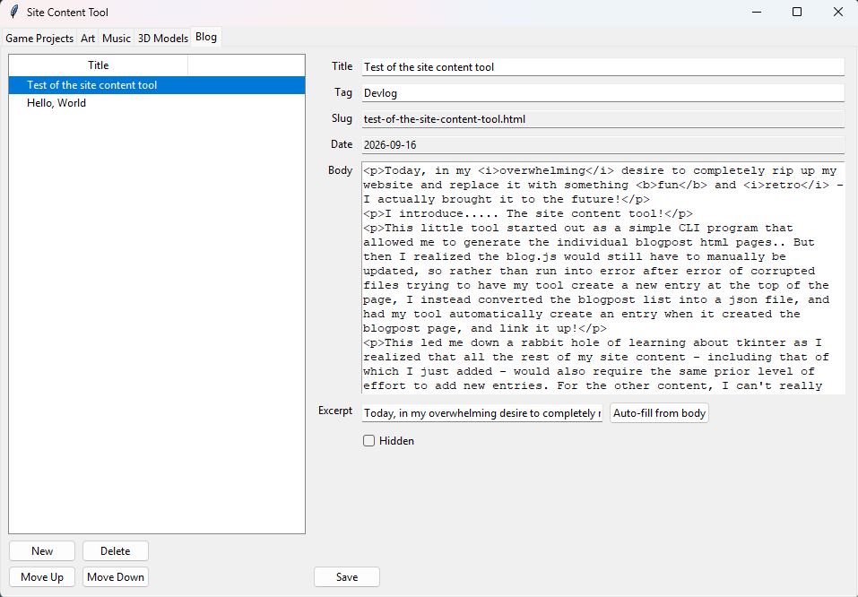

# Site Content Tool

[](https://github.com/PettyPixels/site-content-tool/actions/workflows/tests.yml)

A desktop GUI for managing the content of a static, JSON-driven portfolio website - no hand-editing JSON, no hand-writing HTML.

I built it to run my website [pettypixels.dev](https://pettypixels.dev): every project card, piece of art, 3D model, music release, and blog post on the site is a JSON entry, and this tool is how I create, edit, reorder, and delete them.



## Why it exists

It started as a small CLI that generated blog post HTML pages. That solved half the problem: the blog index still had to be updated by hand, and every attempt to have a script splice a new entry into a JavaScript file risked corrupting it. The fix was to make the data the source of truth. The site now renders every list from a JSON file, and this tool is the only thing that needs to write to them.

Once the blog was JSON-backed, the same pain applied to every other content type, so the CLI grew into a tabbed tkinter app with a form for each.

## Features

- **Tabs for every content type**: Game Projects, Art, Music, 3D Models, and Blog.
- **Create, edit, delete, and reorder** entries. New entries go to the top of the list, so the newest content leads on the site.
- **Image handling**: pick an image with a file dialog and it is copied into the site's `media/images/<type>/` folder. Name collisions are resolved automatically (`cover.png` → `cover-2.png`), and the stored path is site-relative.
- **Blog post generation**: write a title and body, and the tool renders a complete post page from a template, derives a URL slug, stamps the date, and adds the entry to `posts.json`. Body lines that start with `<` are passed through as raw HTML; plain lines are wrapped in `<p>`.
- **Excerpt auto-fill**: pulls the first sentence out of the post body (tags stripped, capped at 150 characters).
- **Per-entry flags**: `hidden` (kept in the data, not shown on the site) and `featured`, where applicable.

## Design notes

**Schema-driven forms.** [`schema.py`](schema.py) declares each content type as data: a list of fields with a name, label, and widget type (`text`, `multiline`, `image`, `list_of_str`, `bool`, `url`, `nested_links`). [`form_panel.py`](form_panel.py) builds the form for any content type from that declaration using a widget registry. Adding a new kind of content means adding one `ContentType` entry, not writing a new form.

**Safe writes.** [`storage.py`](storage.py) never writes JSON in place. It writes to a temp file in the same directory, flushes and `fsync`s it, then swaps it into place with `os.replace()`, which is atomic. A crash or a serialization error mid-save leaves the previous file intact, and the temp file is cleaned up.

**Refuses to clobber bad data.** If a JSON file fails to parse (say, after a hand edit), that tab shows the error and disables saving until the file is fixed. It never overwrites a file it couldn't read.

**Confirmation before destruction.** Deleting an entry asks first. Deleting a blog post also removes its generated HTML file.

**Small, separated modules.** Pure logic (slugs, excerpts, HTML generation, JSON I/O) lives apart from the tkinter UI code, which keeps it easy to reason about and to test.

| File | Responsibility |
| --- | --- |
| `main.py` | Entry point; first-run folder selection |
| `app.py` | Tabbed window and the create/edit/delete/reorder workflow per content type |
| `schema.py` | Declarative definition of each content type's fields |
| `form_panel.py` | Builds and reads entry forms from a schema |
| `list_panel.py` | Entry list with New / Delete / Move Up / Move Down |
| `blog_tab.py` | The Blog tab: post form and post file lifecycle |
| `blog_logic.py` | Slug, excerpt, body-extraction, and post HTML rendering |
| `storage.py` | JSON load/save (atomic) and image copying |
| `settings.py`, `config.py` | Persisted site location and derived paths |

## Site layout it expects

This tool is purpose-built for one site, so it expects that site's structure. Point it at a folder containing:

```
your-site/
├── data/
│   ├── projects.json
│   ├── art.json
│   ├── music.json
│   ├── models.json
│   └── posts.json
├── media/images/<type>/     # created on demand
└── blog/                    # generated post pages
```

Each JSON file is an array of entries, for example a game project:

```json
{
  "title": "Penguin Purge",
  "image": "media/images/games/penguin-purge.png",
  "alt": "Screenshot of Penguin Purge",
  "description": "A horror shooter about ...",
  "tools": ["Godot", "GDScript"],
  "link": "https://example.itch.io/penguin-purge",
  "featured": true,
  "hidden": false
}
```

The full set of fields for each type is in [`schema.py`](schema.py). The site itself is a plain HTML/CSS/JS page that `fetch()`es these files at load time.

## Getting started

Requires **Python 3.10+**. The app itself has no third-party dependencies (tkinter ships with Python).

```bash
python main.py
```

On first launch it asks for your site folder (the one containing `data/` and `media/`) and remembers it in `~/.site-content-tool/settings.json`. Delete that file to be asked again.

### Building a standalone executable

```bash
pip install pyinstaller
pyinstaller SiteContentTool.spec
```

The windowed executable is written to `dist/`.

## Limitations

- It edits files on disk only. Publishing (committing and pushing the site) is a separate step.
- It is coupled to my site's data format and blog template. Reusing it on a different site means editing `schema.py` and the post template in `blog_logic.py`.
- The blog body is edited as raw text and light HTML; there is no rich-text preview.
- Single user, single site, no undo beyond version control.

## Author

Zach Petty - [pettypixels.dev](https://pettypixels.dev) · [GitHub](https://github.com/PettyPixels)
